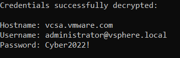

# VmwarePasswordDecryptor

## Overview

When you connect to a remote server, either ESXi or Vsphere, VMware Workstation gives you the option to save your credentials on your computer.
The connection details are saved encrypted. This tool decrypts the configuration details, including the password.

You can read the flow decryption explanation [here]([https://medium.com/xm-cyber/decrypting-vmware-workstation-passwords-for-fun](https://medium.com/xm-cyber/decrypting-vmware-workstation-passwords-for-fun-f34284c5b9cd).

## Prerequisites
Run this command:
```
cd main
pip3 install -r requirement.txt
```

## Get started
To decrypt the connection details, run:
```commandline
python3 main.py
```
You'll see similar to the following:



## Usage
```commandline
main.py [-c|-t]
-c      print fully decrypted configuration data 
-t      test decrypted credentials 
-h      print this help
```
